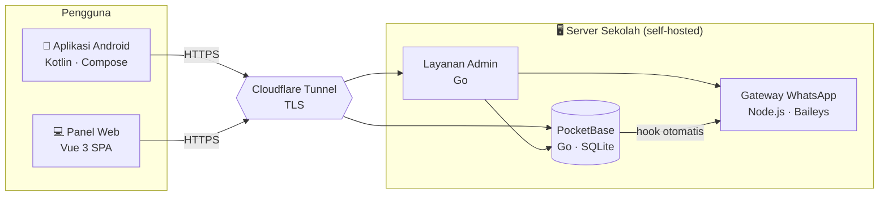

# Arsitektur

Gambaran tingkat tinggi. Detail infrastruktur (domain, host, path, kunci) **sengaja tidak dicantumkan** demi keamanan.

## Peta Komponen

## Peran Tiap Bagian

| Bagian | Tanggung jawab |
|---|---|
| **Aplikasi Android** | Antarmuka siswa (absen wajah), guru & BK (pantau + catatan). Pengenalan wajah & liveness diproses **di perangkat**. |
| **PocketBase** | Basis data + **aturan akses per koleksi** + **hook** (paksa tanggal server, hitung telat/alfa, auto-alfa, notifikasi). Sumber kebenaran data. |
| **Layanan Admin (Go)** | Menyajikan panel web (SPA), proxy foto terlindungi, rekap, konfigurasi, kelola akun, rilis aplikasi. |
| **Gateway WhatsApp** | Mengirim notifikasi otomatis (mis. pemberitahuan Alfa) via nomor khusus. |
| **Cloudflare Tunnel** | Menyembunyikan alamat server & memberi TLS tanpa membuka port publik. |

## Prinsip Aliran Data

- **Wajah tidak pernah keluar sebagai foto mentah** untuk pencocokan — hanya representasi matematis (embedding) yang tersimpan; verifikasi dilakukan di perangkat.
- **Waktu & tanggal absensi ditentukan server** (WIB), bukan jam HP — mencegah backdate & manipulasi telat.
- **Koordinat lokasi tidak disimpan/ditampilkan** — hanya status "di dalam / di luar area".
- **Foto bukti absen** disimpan sebagai berkas **terlindungi** (hanya bisa diakses lewat proxy panel yang terautentikasi).
- Aturan akses ditegakkan **di server** (bukan sekadar disembunyikan di antarmuka).

## Teknologi

- **Android:** Kotlin, Jetpack Compose, penyimpanan terenkripsi (AES-256-GCM), R8/obfuscation.
- **Backend:** PocketBase (Go, SQLite), migrasi & hook JavaScript.
- **Panel:** Go (server) + Vue 3, TypeScript, Vite, Pinia, Naive UI (SPA), CSP ketat berbasis nonce.
- **Notifikasi:** Node.js (Baileys) — nomor WhatsApp khusus.
- **Operasional:** systemd, backup terjadwal + offsite, healthcheck 5 menit.

---

[⬅️ Diagram Alur](FLOWCHARTS.md) · [Fitur ➡️](FEATURES.md)
