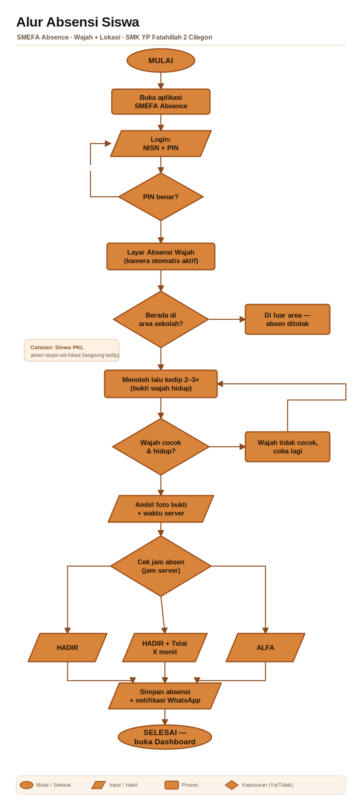
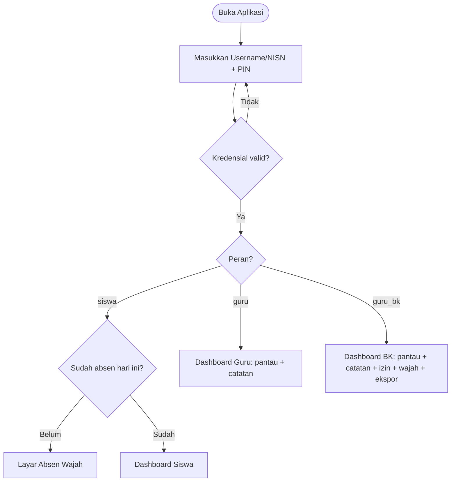
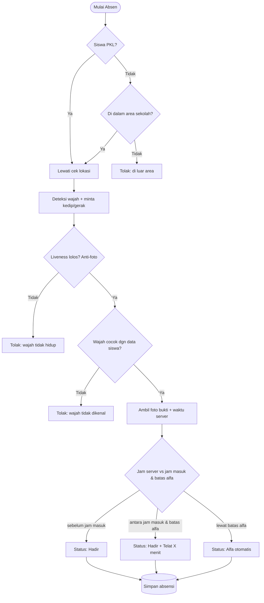
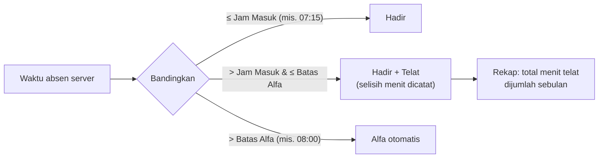
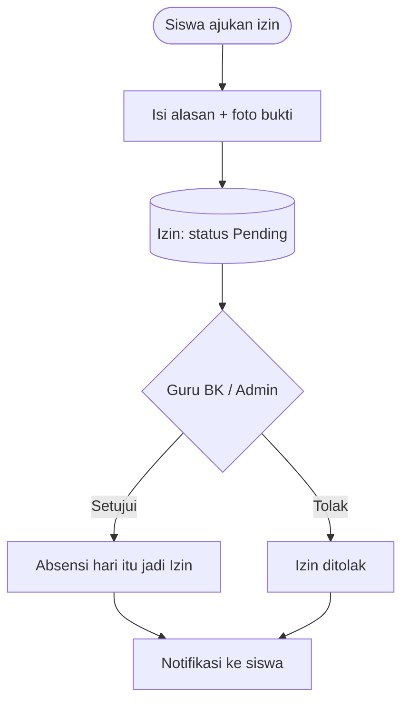
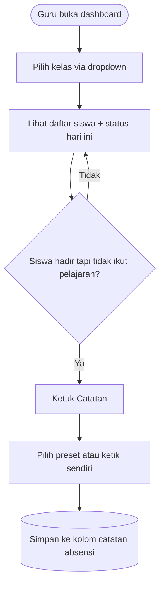
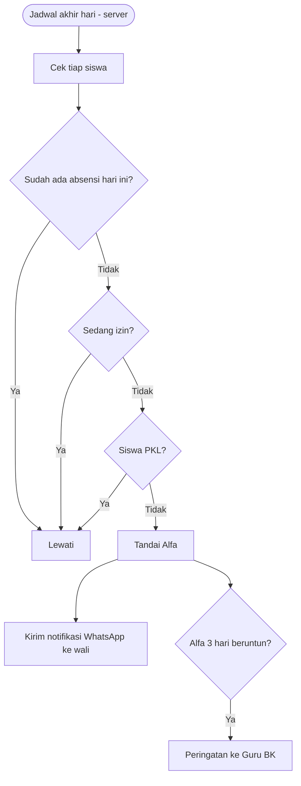
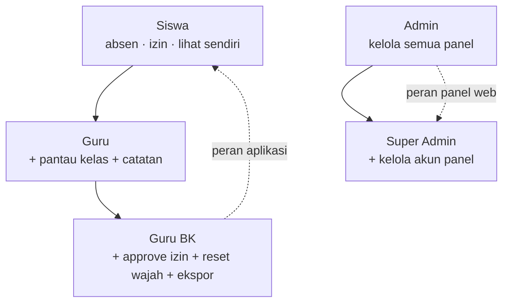

# Diagram Alur

Panduan langkah demi langkah ada di [Panduan Penggunaan](PANDUAN.md). Halaman ini kumpulan diagram alur sistem.

## Alur absensi siswa

Proses absen harian, dari login sampai kehadiran tersimpan:

Alur pertama kali, dilakukan sekali saat mulai pakai:

---

## Diagram rinci

Diagram di bawah memakai Mermaid dan otomatis tampil sebagai gambar saat dibuka di GitHub.

---

## 1. Login & Pengarahan Peran

Saat login, sistem mengarahkan pengguna ke tampilan sesuai perannya. Guru & BK **tidak** melewati absen wajah.

## 2. Absen Wajah (Masuk)

Absen hanya berhasil bila **wajah hidup terverifikasi** dan **posisi di area sekolah** (kecuali siswa PKL).

## 3. Perhitungan Telat & Alfa

Waktu selalu diambil dari **jam server** (bukan jam HP) supaya tidak bisa dicurangi.

## 4. Alur Izin

Siswa mengajukan izin; Guru BK/Admin menyetujui atau menolak.

## 5. Catatan Guru (siswa hadir tapi keluar kelas)

## 6. Alfa Otomatis & Notifikasi WhatsApp

Di akhir hari, siswa yang tidak absen (dan tidak izin) otomatis ditandai Alfa; orang tua dikabari.

## 7. Hierarki Peran & Hak

---

[⬅️ Peran & Hak Akses](ROLES.md) · [Arsitektur ➡️](ARCHITECTURE.md)
