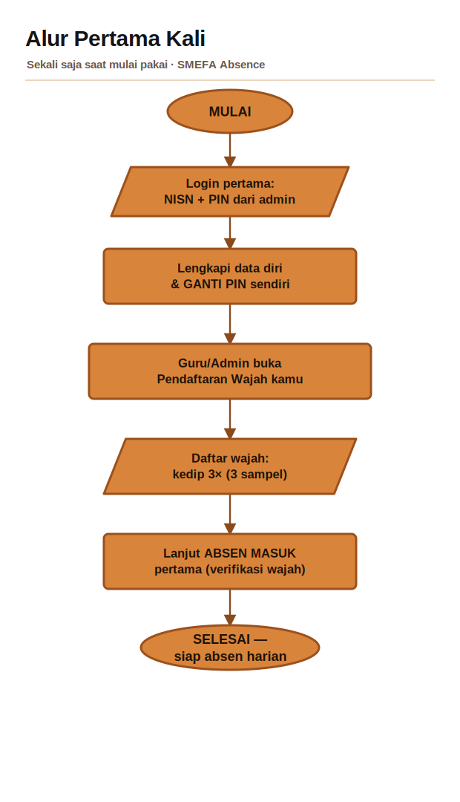

# Panduan Penggunaan — SMEFA Absence

Selamat datang di panduan resmi aplikasi **SMEFA Absence**, aplikasi absensi **SMK YP Fatahillah 2 · Cilegon** yang memakai **verifikasi wajah** (anti titip absen) dan **penguncian lokasi sekolah** (geofence). Dokumen ini ditujukan untuk seluruh warga sekolah yang memakai aplikasi — **siswa**, **guru mata pelajaran**, dan **guru BK**. Silakan langsung menuju bagian yang sesuai dengan peranmu lewat Daftar Isi di bawah. Baca sekali dari atas saat pertama kali; setelah terbiasa, penggunaan harian hanya butuh beberapa detik.

## Daftar Isi

1. [Panduan Siswa](#panduan-siswa)
2. [Panduan Guru (Guru Mapel)](#panduan-guru-guru-mapel)
3. [Panduan Guru BK](#panduan-guru-bk)
4. [Glosarium & Status](#glosarium--status)
5. [Tanya-Jawab (FAQ) & Solusi Masalah](#tanya-jawab-faq--solusi-masalah)
6. [Ceklis Cepat](#ceklis-cepat)

## 🧭 Alur Ringkas (Diagram)

Dua diagram di bawah merangkum keseluruhan proses. Yang pertama untuk **pemakaian pertama kali** (dilakukan sekali saja), yang kedua untuk **absen harian**.

**Alur Pertama Kali — sekali saja saat mulai pakai:**

**Alur Absensi Harian — proses setiap hari dari login sampai tersimpan:**

> 💡 Bentuk pada diagram: **oval** = mulai/selesai, **jajar genjang** = input/hasil, **persegi** = proses, **belah ketupat** = keputusan (Ya/Tidak).

---

## Panduan Siswa

Dengan aplikasi ini kamu absen memakai **wajah** (bukan tanda tangan atau titip absen) dan **hanya bisa absen saat berada di lingkungan sekolah**. Panduan ini menuntun kamu dari nol — pasang aplikasi sampai berhasil absen setiap hari.

> Baca sekali dari atas sampai bawah saat pertama kali. Setelah terbiasa, absen harian cuma butuh beberapa detik.

### 0. Yang Perlu Disiapkan

Sebelum mulai, pastikan kamu punya:

| Kebutuhan | Keterangan |
|---|---|
| 📱 HP Android | Punya kamera depan yang berfungsi |
| 🔢 NISN | Nomor Induk Siswa Nasional kamu (dari sekolah) |
| 🔑 PIN awal | PIN sementara yang diberikan **admin/guru**. Wajib kamu ganti nanti |
| 🌐 Internet | Data seluler / WiFi aktif (absen butuh koneksi ke server) |
| 📍 GPS / Lokasi | Fitur lokasi HP menyala saat absen |

> **Belum punya NISN atau PIN awal?** Hubungi wali kelas atau admin sekolah. Aplikasi tidak bisa dipakai tanpa dua ini.

### 1. Pasang Aplikasi & Beri Izin

1. Pasang file aplikasi (APK) **SMEFA Absence** yang dibagikan sekolah.
2. Kalau muncul peringatan "aplikasi dari sumber tidak dikenal", pilih **Izinkan / Setelan → Izinkan dari sumber ini** untuk aplikasi yang memasang (mis. File Manager atau Browser). Ini normal karena aplikasi tidak dibagikan lewat Play Store.
3. Buka aplikasi. Saat pertama kali dibuka, akan muncul beberapa **permintaan izin berurutan**. Pilih **Izinkan** untuk semuanya:
   - 📷 **Kamera** — untuk absen wajah.
   - 📍 **Lokasi** — untuk memastikan kamu di area sekolah. Bila ada pilihan, pilih **"Saat aplikasi digunakan"** dan **"Lokasi presisi/tepat"**.
   - 🔔 **Notifikasi** — untuk pengingat.

#### Setel GPS ke Akurasi Tinggi (penting!)

Supaya lokasi kamu terbaca cepat dan tidak salah "di luar sekolah":

1. Buka **Setelan HP → Lokasi**.
2. Pastikan **Lokasi ON**.
3. Masuk ke **Layanan Lokasi / Akurasi Lokasi** lalu **aktifkan "Akurasi Tinggi"** (High accuracy). Nama menunya bisa beda tiap merek HP, tapi intinya GPS + WiFi + jaringan dipakai bersama.

> **Tips:** biarkan izin lokasi & kamera tetap "Izinkan". Kalau tidak sengaja menekan "Tolak", absen tidak akan jalan dan kamu harus mengaktifkannya lagi lewat **Setelan → Aplikasi → SMEFA Absence → Izin**.

**Kalau gagal / error:**
- *Aplikasi tidak bisa dipasang* → cek ruang penyimpanan HP cukup, dan izinkan pemasangan dari sumber tak dikenal (langkah 2).
- *Izin tak sengaja ditolak* → buka **Setelan → Aplikasi → SMEFA Absence → Izin**, aktifkan **Kamera** dan **Lokasi** secara manual.

### 2. Login Pertama (NISN + PIN awal)

1. Buka aplikasi. Kamu akan melihat layar **Login Absensi**.
2. Isi kolom **NISN** dengan nomor NISN kamu.
3. Isi kolom **PIN** dengan **PIN awal dari admin**. (Tekan ikon 👁️ di kanan kolom untuk menampilkan/menyembunyikan PIN.)
4. Tekan tombol **Masuk**.

Setelah login berhasil, aplikasi otomatis mengarahkan kamu:
- Kalau ini **pertama kali** → lanjut ke layar **Lengkapi Data & Ganti PIN** (Bagian 3).
- Kalau data sudah lengkap & **belum absen hari ini** → langsung ke **Absensi Wajah**.
- Kalau **sudah absen hari ini** → langsung ke **Dashboard**.

**Kalau gagal / error:**
- *"NISN atau PIN salah."* → cek lagi ketikan NISN dan PIN. PIN hanya angka. Pastikan tidak ada spasi.
- *"Gagal cek absensi" / tidak ada reaksi* → koneksi internet lemah. Nyalakan data/WiFi, tunggu sinyal stabil, lalu tekan **Masuk** lagi.
- *Muncul layar "Sedang Pemeliharaan" atau "Update Wajib"* → server sedang dirawat atau ada versi baru. Kalau **Update Wajib**, tekan **Download Update** dan pasang versi terbaru dulu.
- *Lupa PIN* → tekan **Lupa PIN?** (lihat Bagian 8).

### 3. Lengkapi Data & Ganti PIN

Layar ini **wajib diisi sekali saja** saat pertama kali. Judulnya **"Lengkapi Data & Ganti PIN"**.

1. Cek data di kartu atas: **nama, NISN, kelas/jurusan**. Data ini **tidak bisa diubah** (read-only). **Kalau ada yang salah, lapor admin** — jangan lanjut kalau nama/NISN keliru.
2. Isi **Nomor WhatsApp kamu \*** (wajib, minimal 8 digit). Nomor ini dipakai untuk **reset PIN** kalau suatu saat kamu lupa, jadi isi yang benar dan aktif.
3. Isi **Nomor WhatsApp orang tua/wali** (dianjurkan, untuk info ke orang tua).
4. Isi **Email** (opsional, boleh dikosongkan).
5. Buat **PIN baru (4–6 digit)** — **jangan** pakai PIN default dari admin. Buat yang mudah kamu ingat tapi tak mudah ditebak.
6. Ketik ulang di kolom **Ulangi PIN baru** (harus sama persis).
7. Tekan **Simpan & Lanjut**.

Kalau berhasil, muncul pesan **"Data tersimpan. Selamat datang!"** dan kamu langsung diarahkan ke **Absensi Wajah**.

**Kalau gagal / error:**
- *"Nomor WhatsApp kamu wajib & minimal 8 digit."* → isi nomor WA kamu dengan benar.
- *"PIN baru harus 4–6 digit."* → PIN hanya boleh 4 sampai 6 angka.
- *"Konfirmasi PIN tidak sama."* → kolom PIN dan Ulangi PIN harus persis sama.
- *"Email tidak valid."* → kosongkan saja email, atau tulis format benar (contoh: nama@email.com).
- *"Gagal terhubung ke server."* → cek internet, lalu tekan **Simpan & Lanjut** lagi.

> **Ingat PIN baru kamu!** Setelah ini, kamu login memakai PIN baru, bukan PIN awal dari admin.

### 4. Pendaftaran Wajah Pertama

Sebelum bisa absen, wajah kamu harus **didaftarkan** dulu. Ini **hanya sekali**.

> ⚠️ **Pendaftaran wajah harus DIBUKA dulu oleh admin/guru lewat panel web sekolah.** Kalau belum dibuka, kamu belum bisa mendaftar. Ini bukan tombol di aplikasi HP — cukup minta admin/guru membuka pendaftaran wajah kamu terlebih dahulu.

Cara mendaftar (di layar **Absensi Wajah**):

1. Kamera depan menyala otomatis. Posisikan wajah di dalam **bingkai oval**.
2. Pastikan wajah **terang, tidak membelakangi cahaya, dan tanpa masker**.
3. Ikuti perintah di layar: **"👁️ Kedipkan mata untuk mendaftarkan wajah."** → kedipkan mata sekali sambil menghadap lurus ke kamera.
4. Aplikasi mengambil **3 sampel** wajah. Kamu akan melihat **"Mendaftarkan wajah 1/3 — kedipkan mata lagi."**, lalu **2/3**, lalu **3/3**. Setiap kali diminta, kedipkan mata lagi.
5. Setelah 3 sampel terkumpul, muncul **"Menyimpan data wajah..."** dan kamu langsung tercatat absen masuk. 🎉

**Kalau gagal / error:**
- *"Pendaftaran wajah belum dibuka guru. Minta guru buka pendaftaran wajah kamu dulu."* → temui guru/BK untuk membuka pendaftaran. Ini bukan kesalahan aplikasi.
- *"Memuat data wajah…" lama sekali* → koneksi lambat; tunggu atau tekan **Muat ulang**.
- *Wajah tidak terdeteksi* → dekatkan wajah, cari tempat lebih terang, pastikan hanya **satu wajah** di kamera (jangan ada teman ikut kelihatan).
- *"Gagal mendaftarkan wajah. Jika berulang, hubungi admin."* → coba ulang sekali lagi; kalau tetap gagal, lapor admin.

> **Tips:** daftarkan wajah dengan penampilan sehari-hari kamu (mis. tanpa kacamata hitam, tanpa masker) supaya cocok saat absen harian.

### 5. Absen Masuk Harian (langkah demi langkah)

Setelah wajah terdaftar, absen masuk sangat cepat:

1. **Buka aplikasi** dan **login** (NISN + PIN). Kalau kamu belum absen hari ini, aplikasi langsung membuka layar **Absensi Wajah**.
2. Aplikasi **mengecek lokasi otomatis** — muncul **"📍 Mengecek lokasi… (pastikan GPS aktif)"**. Tunggu beberapa detik.
3. Kalau kamu berada **di area sekolah**, kamera aktif dan muncul tantangan gerak (liveness) supaya foto/rekaman tidak bisa menipu sistem:
   > **"🔄 Palingkan wajah ke samping sebentar, lalu hadap depan & kedip _N_ kali."** (_N_ acak 2–3)
4. Ikuti: **palingkan wajah ke samping** sedikit, lalu muncul **"✅ Bagus! Hadap depan lalu kedipkan mata …"** — **hadap lurus** ke kamera dan **kedipkan mata** sesuai jumlah yang diminta.
5. Aplikasi memverifikasi wajah ("Memverifikasi wajah..."). Kalau cocok, muncul **"Absen berhasil! Selamat datang, {nama} 👋"** dan kamu masuk ke **Dashboard**.

#### Arti Hadir / Telat / Alfa

Status kehadiran dihitung dari **jam server** (bukan jam di HP kamu). Jam pastinya diatur admin — di bawah ini contoh saja:

| Kapan kamu absen masuk | Status |
|---|---|
| Sebelum jam masuk (mis. 07:15) | ✅ **Hadir** |
| Antara jam masuk dan batas alfa (mis. 07:15–08:00) | ✅ **Hadir** + catatan **⏰ Telat X menit** |
| Lewat batas alfa (mis. setelah 08:00) atau tidak absen sama sekali | ❌ **Alfa** |

> Karena pakai jam server, **mengubah jam di HP tidak akan membantu**. Datang dan absen lebih awal adalah satu-satunya cara aman.

**Kalau gagal / error:**

| Pesan / Masalah | Penyebab & Solusi |
|---|---|
| **"GPS tidak aktif / lokasi belum terbaca…"** | GPS mati atau sinyal lemah. Aktifkan GPS **mode Akurasi Tinggi**, keluar sebentar ke area terbuka (dekat jendela/lapangan), lalu tekan **Coba Lagi**. |
| **"Kamu di luar area sekolah. Absen hanya bisa di lingkungan sekolah."** | Kamu belum benar-benar di dalam lingkungan sekolah, atau lokasi meleset. Masuk ke area sekolah, tunggu GPS akurat, tekan **Coba Lagi**. |
| **"Wajah tidak cocok, coba sekali lagi."** | Pencahayaan kurang, wajah tertutup, atau posisi miring. Cari tempat terang, buka masker/topi, hadap lurus, lalu **kedipkan mata lagi** (otomatis mengulang). |
| **"Izin lokasi belum diberikan."** | Aktifkan izin lokasi lewat **Setelan → Aplikasi → SMEFA Absence → Izin**. |
| **"Kamu sudah tertandai Alfa hari ini. Hubungi guru BK untuk koreksi."** | Kamu absen setelah lewat batas alfa. Absensi sudah terkunci Alfa — hanya **guru BK** yang bisa mengoreksi. |
| **"Model verifikasi wajah belum terpasang. Hubungi admin."** | Aplikasi belum lengkap. Lapor admin. |
| Kamera hitam / **"Izin kamera belum diberikan."** | Aktifkan izin **Kamera** di setelan aplikasi. |

> **Tips biar sukses:** wajah di dalam bingkai oval, cahaya dari **depan** (jangan membelakangi jendela), lepas masker/kacamata hitam, dan hanya wajah kamu yang terlihat kamera.

### 6. Absen Pulang

Absen pulang **baru muncul** di Dashboard **setelah kamu sudah Hadir hari ini**. Buka **Dashboard**, cari kartu **"Absen Pulang"**. Ada dua pilihan:

#### A. Pulang Normal

Untuk pulang biasa di jam pulang sekolah.

1. Tekan **Pulang Normal**.
2. Layar **Absensi Wajah** terbuka. Ikuti tantangan **menoleh + kedip** seperti absen masuk.
3. Kalau berhasil: **"Absen pulang tercatat. Hati-hati di jalan, {nama} 👋"**. Status kamu tetap **Hadir**, dan jam pulang ikut tercatat.

#### B. Pulang Izin (Sakit/Keperluan)

Untuk pulang **lebih awal** karena sakit atau ada keperluan.

1. Tekan **Pulang Izin**. Muncul dialog **"Pulang Izin (Sakit/Keperluan)"**.
2. Isi kolom **Alasan** (mis. "Sakit, izin ke rumah").
3. Lampirkan **foto bukti** — **utamakan** tombol **📷 Foto Langsung** (foto realtime). Tombol **📁 Pilih File** hanya untuk surat/dokumen. Kalau berhasil muncul **"✓ Foto terpilih"**.
4. Tekan **Verifikasi Wajah & Kirim**.
5. Lakukan verifikasi wajah (menoleh + kedip). Kalau berhasil: **"Izin pulang terkirim (status: Izin). Semoga sehat, {nama} 🙏"**. Status hari itu berubah menjadi **Izin**.

**Kalau gagal / error:**
- *Kartu "Absen Pulang" tidak muncul* → kamu belum Hadir hari ini, atau sudah absen pulang. (Kalau sudah, muncul **"Kamu sudah absen pulang jam …"**.)
- *"Alasan wajib diisi" / "Foto bukti wajib dilampirkan"* → lengkapi alasan dan foto dulu.
- *"Kamu belum absen masuk hari ini."* → absen masuk dulu sebelum bisa absen pulang.
- *Verifikasi wajah gagal* → sama seperti absen masuk: cari tempat terang, hadap lurus, kedip ulang.

### 7. Ajukan Izin (Sakit/Keperluan) dari Layar Login

Kalau kamu **tidak bisa hadir** (mis. sakit di rumah), ajukan izin **tanpa harus absen** — langsung dari layar Login.

1. Di layar **Login Absensi**, tekan **Ajukan Izin**.
2. Muncul dialog **"Form Izin"**. Isi:
   - **NISN** kamu.
   - **PIN** kamu.
   - **Alasan** (mis. "Sakit demam").
3. Lampirkan **foto bukti** (WAJIB): tekan **📷 Foto Langsung** (utamakan) atau **📁 Pilih File** untuk surat dokter. Muncul **"✓ Foto terpilih"** bila berhasil.
4. Tekan **Kirim**.
5. Kalau berhasil muncul **"Pengajuan izin berhasil!"**.

Izin kamu akan **diperiksa dan disetujui/ditolak oleh Guru BK/Admin**. Kalau disetujui, status hari itu menjadi **Izin** (bukan Alfa).

**Kalau gagal / error:**
- *"Semua field wajib diisi"* → lengkapi NISN, PIN, dan Alasan.
- *"Foto bukti wajib dilampirkan"* → tambahkan foto bukti dulu.
- *"NISN/PIN salah atau izin hari ini sudah ada."* → cek NISN/PIN kamu; atau kamu memang sudah pernah mengajukan izin hari ini (tidak bisa dobel).
- *"Gagal terhubung ke server."* → cek internet lalu tekan **Kirim** lagi.

> **Penting:** ajukan izin **sebelum batas alfa** supaya kamu tidak keburu tertandai Alfa otomatis di akhir hari.

### 8. Lupa PIN (Reset lewat OTP WhatsApp)

Kalau lupa PIN, kamu bisa reset sendiri lewat WhatsApp yang kamu daftarkan saat setup.

1. Di layar **Login**, tekan **Lupa PIN?**.
2. Muncul dialog **"Lupa PIN"**. Isi **NISN** kamu, lalu tekan **Kirim Kode**.
3. Kode **OTP** dikirim ke **WhatsApp yang terdaftar** (berlaku **5 menit**).
4. Layar berganti ke **"Masukkan Kode OTP"**. Isi:
   - **Kode OTP** dari WhatsApp.
   - **PIN baru (4–6 digit)**.
5. Tekan **Ganti PIN**. Kalau berhasil muncul **"PIN berhasil diganti. Silakan login dengan PIN baru."**
6. Login kembali dengan **PIN baru** kamu.

**Kalau gagal / error:**
- *"NISN wajib diisi." / "Kode OTP wajib." / "PIN baru harus 4-6 digit."* → lengkapi kolom sesuai pesan.
- *OTP tidak masuk WhatsApp* → cek koneksi, tunggu sebentar, pastikan nomor WA yang kamu daftarkan saat setup memang aktif. Kalau nomor sudah tidak aktif/berubah, **hubungi admin** untuk reset manual.
- *OTP kedaluwarsa* → kode hanya berlaku 5 menit. Ulangi dari **Kirim Kode**.

### 9. Membaca Dashboard: Statistik & Riwayat

Setelah login/absen, kamu berada di **Dashboard** dengan header **"Selamat datang, {nama}!"**.

#### Kotak Statistik

Empat kotak menampilkan rekap kamu:

| Kotak | Arti |
|---|---|
| 🟢 **Hadir** | Jumlah hari kamu hadir |
| 🔵 **Izin** | Jumlah hari izin (sakit/keperluan yang disetujui) |
| 🔴 **Alfa** | Jumlah hari tanpa keterangan |
| ⚪ **Belum** | Hari yang belum ada catatannya |

#### Kartu "Riwayat Absensi Saya"

Daftar absensi kamu dari terbaru. Tiap baris menampilkan **tanggal** dan **label status**:

| Label | Arti |
|---|---|
| 🟢 **Hadir** | Kamu hadir hari itu |
| 🔵 **Izin** | Izin disetujui |
| 🔴 **Alfa** | Tanpa keterangan |
| ⚪ **Belum** | Belum tercatat |
| **⏰ Telat X menit** | Kamu hadir tapi lewat jam masuk |
| **📝 (catatan)** | Catatan dari guru (mis. "Izin ke UKS") |

> Kalau kamu sudah absen pulang, kartu **"Absen Pulang"** akan menampilkan **"Kamu sudah absen pulang jam … Hati-hati di jalan 👋"**.

### 10. Siswa PKL (Absen Tanpa Geofence)

Kalau kamu sedang **PKL (Praktik Kerja Lapangan)** dan sudah didaftarkan sebagai siswa PKL oleh admin, kamu **tidak perlu berada di area sekolah** untuk absen — kamu bisa absen dari tempat PKL.

- Prosesnya **sama** seperti absen biasa: buka aplikasi → login → **Absensi Wajah**.
- Bedanya, aplikasi **langsung melewati pengecekan lokasi sekolah** dan langsung menampilkan tantangan verifikasi wajah. Tidak ada teks khusus di layar — prosesnya hanya terasa sedikit lebih cepat karena langkah cek lokasi dilewati.
- **Verifikasi wajah + gerak (menoleh & kedip) TETAP wajib.** Jadi hanya kamu sendiri yang bisa absen.

**Kalau gagal / error:**
- *Masih diminta berada di area sekolah / muncul "di luar area sekolah"* → status PKL kamu mungkin belum diaktifkan admin, atau koneksi gagal membacanya. Pastikan internet aktif dan **hubungi admin** untuk memastikan kamu terdaftar sebagai siswa PKL.
- *Verifikasi wajah gagal* → sama seperti biasa: tempat terang, hadap lurus, kedip ulang.

### ✅ Tips Umum Biar Absen Selalu Sukses

1. **Datang lebih awal** — absen sebelum jam masuk supaya aman dari Telat/Alfa.
2. **Nyalakan GPS mode Akurasi Tinggi** dan internet **sebelum** membuka aplikasi.
3. **Wajah terang & jelas** — hadap cahaya, jangan membelakangi jendela, lepas masker/topi/kacamata hitam.
4. **Satu wajah saja** di kamera — jangan ada teman ikut terlihat.
5. **Ikuti perintah gerak** dengan tenang: menoleh sedikit dulu, baru hadap depan dan kedip.
6. **Ingat PIN baru** dan pastikan **nomor WhatsApp aktif** (untuk reset PIN).
7. Kalau ada tombol **Coba Lagi**, tekan setelah memperbaiki masalah (GPS/lokasi/cahaya).
8. **Jangan mengubah jam HP** untuk mengakali Telat — sistem memakai jam server.

### 🆘 Kapan Harus Lapor ke Guru/Admin

- Nama, NISN, atau kelas **salah** di layar setup.
- **Pendaftaran wajah belum dibuka** (butuh guru/BK).
- Sudah **tertandai Alfa** padahal seharusnya Hadir/Izin (koreksi oleh **guru BK**).
- Nomor WhatsApp sudah tidak aktif sehingga **tidak bisa reset PIN**.
- Muncul pesan **"Model verifikasi wajah belum terpasang"** atau error yang berulang terus.

[Kembali ke README](../README.md)

---

## Panduan Guru (Guru Mapel)

Panduan ini untuk **guru mata pelajaran**. Sebagai guru, kamu **tidak perlu absen wajah**. Setelah login kamu langsung masuk ke Dashboard untuk **memantau kehadiran siswa** dan memberi **catatan** bila ada siswa yang keluar/izin saat pelajaran.

> Catatan: Guru mapel bisa **melihat dan mencatat**, tetapi **tidak bisa mengubah** kehadiran, jam, atau status siswa. Fitur seperti menyetujui izin, reset wajah, dan export data hanya dimiliki **Guru BK**.

### 1. Masuk (Login)

1. Buka aplikasi **SMEFA Absence**.
2. Saat pertama kali dibuka, aplikasi akan meminta izin **kamera, lokasi, dan notifikasi**. Silakan **Izinkan** saja (ini dibutuhkan aplikasi secara umum, walau guru tidak absen wajah).
3. Pada kolom **NISN**, masukkan **akun guru** yang diberikan admin (NISN/username akun kamu).
4. Masukkan **PIN** kamu. Ketuk ikon mata di ujung kolom PIN untuk menampilkan/menyembunyikan angka.
5. Ketuk tombol **Masuk**.
6. Karena akunmu berperan sebagai guru, aplikasi **langsung membuka Dashboard** (tanpa absen wajah dan tanpa geofence).

#### 🔧 Kalau gagal / error saat login

| Masalah | Penyebab umum | Solusi |
|---|---|---|
| Muncul "NISN atau PIN salah." | Salah ketik NISN/PIN, atau akun belum aktif | Cek ulang, pastikan PIN benar. Kalau tetap gagal, hubungi admin. |
| "NISN wajib diisi" / "PIN wajib diisi" | Ada kolom yang kosong | Isi kedua kolom lebih dulu, baru ketuk **Masuk**. |
| Layar berputar lama / "Gagal terhubung ke server" | Sinyal/internet lemah | Pastikan HP terhubung internet (WiFi/data), lalu coba lagi. |
| Lupa PIN | — | Ketuk **Lupa PIN?** untuk menerima kode OTP lewat WhatsApp yang terdaftar, lalu buat PIN baru. Kalau nomor WhatsApp belum terdaftar, hubungi admin untuk reset. |
| Muncul layar **Update Wajib** / **Sedang Pemeliharaan** | Ada versi baru atau server sedang dirawat | Untuk update, ketuk **Download Update**. Untuk pemeliharaan, tunggu beberapa saat lalu buka lagi. |

### 2. Mengenal Dashboard Guru

Setelah masuk, di bagian atas ada sapaan **"Selamat datang, {nama}!"** dan ikon **keluar (logout)** di pojok kanan.

Gulir ke bawah sampai kartu **"Pantau Kehadiran Siswa"**. Di situ ada teks arahan:

> *"Pilih kelas, lalu lihat kehadiran hari ini atau rekap sebulan. Untuk siswa yang hadir tapi keluar/izin saat pelajaran, ketuk 'Catatan'."*

#### Filter (Jurusan & Kelas)

Di dalam kartu itu ada **dua tombol filter** bersebelahan:

1. **Jurusan** — pilih salah satu: **Semua**, **TKJ**, **DKV**, **MPLB**, atau **AKL**.
2. **Kelas** — pilih salah satu: **Semua**, **10**, **11**, atau **12**.

Ketuk tombolnya, lalu pilih dari daftar yang muncul. Daftar siswa dan rekap akan **otomatis menyesuaikan** filter yang kamu pilih. Untuk melihat satu kelas tertentu (mis. **11 · TKJ**), atur kedua filter tersebut.

Di bawah filter ada dua tombol tab: **Hari Ini** dan **Rekap Bulan Ini**.

Di bagian paling bawah layar ada menu **Home** dan **Credit** (informasi aplikasi & tim pengembang).

### 3. Tab "Hari Ini"

Ketuk tab **Hari Ini** untuk melihat kehadiran siswa **pada hari berjalan**.

1. Di bagian atas ada **kotak ringkasan**: **Hadir**, **Izin**, **Alfa**, dan **Belum** (jumlah siswa per status sesuai filter).
2. Di bawahnya ada kartu **"Daftar Siswa (jumlah)"**. Tiap baris menampilkan:
   - **Nama siswa** dan **kelas + jurusan**.
   - **Status hari ini**, berupa label warna: **Hadir**, **Izin**, **Alfa**, atau **Belum** (belum absen).
   - **Menit telat** (bila ada), muncul sebagai lencana **⏰**, mis. "⏰ 20 menit". Telat dihitung dari **jam server**, bukan jam HP.
   - **Catatan** yang sudah ada (bila ada), muncul sebagai lencana **📝**.
   - Tombol **Catatan** (atau **Ubah Catatan** kalau sudah pernah diisi) di sisi kanan baris.

#### Paginasi (halaman)

Kalau siswa lebih dari 12 orang, daftar dibagi per halaman. Di bawah daftar ada:
- **‹ Sebelumnya** dan **Berikutnya ›** untuk pindah halaman.
- Tulisan **"Halaman X / Y"** sebagai penunjuk posisi.

> Tentang status kehadiran & telat: sebelum jam masuk (mis. 07.15) siswa dihitung **Hadir**; antara jam masuk dan batas alfa (mis. 08.00) dihitung **Hadir + Telat sekian menit**; lewat batas alfa dihitung **Alfa**. Jam persisnya diatur admin, jadi angka di atas hanya contoh. **Alfa** juga otomatis diberikan di akhir hari untuk siswa yang tidak absen dan tidak izin.

### 4. Tab "Rekap Bulan Ini"

Ketuk tab **Rekap Bulan Ini** untuk melihat **rekap sebulan berjalan per siswa** (mengikuti filter Jurusan & Kelas yang aktif).

1. Judul kartu menampilkan **"Rekap Bulan Ini (jumlah siswa)"**.
2. Tiap baris siswa menampilkan **nama**, **kelas + jurusan**, lalu **ringkasan** dalam satu baris, contoh:

   > **Hadir 18 · Telat 3× (1 jam 15 menit) · Izin 2 · Alfa 1**

   Artinya:
   - **Hadir 18** → total hari hadir bulan ini.
   - **Telat 3× (1 jam 15 menit)** → 3 kali terlambat, dengan **total** keterlambatan 1 jam 15 menit. (Bagian ini hanya muncul kalau ada keterlambatan.)
   - **Izin 2** → total hari izin (hanya muncul kalau ada).
   - **Alfa 1** → total hari alfa (hanya muncul kalau ada).
3. Siswa yang **belum punya catatan absensi sama sekali** tetap ditampilkan (mis. "Hadir 0").
4. Paginasi sama seperti tab Hari Ini: **‹ Sebelumnya**, **Halaman X / Y**, **Berikutnya ›**.

### 5. Memberi Catatan untuk Siswa

Gunakan **Catatan** untuk siswa yang **sudah hadir hari ini** tetapi keluar/izin saat pelajaran (mis. ke UKS, dipanggil BK, ambil barang).

1. Buka tab **Hari Ini**, cari nama siswanya.
2. Ketuk tombol **Catatan** (atau **Ubah Catatan**) pada baris siswa tersebut.
3. Muncul dialog **"Catatan — {nama siswa}"**. Kamu bisa:
   - **Pilih catatan cepat** dengan mengetuk salah satu tombol preset:
     - **Izin Ambil Barang**
     - **Izin ke UKS / Sakit**
     - **Dipanggil Guru/BK**
     - **Tugas/Kegiatan Sekolah**
   - atau **ketik sendiri** pada kolom **Catatan** (maksimal 200 karakter).
4. Ketuk **Simpan**. Akan muncul pemberitahuan **"Catatan disimpan ✅"**, dan lencana **📝** muncul di baris siswa.
5. Untuk **menghapus** catatan, buka lagi dialognya lalu ketuk **Hapus** (muncul pemberitahuan **"Catatan dihapus"**).
6. Untuk menutup tanpa mengubah apa pun, ketuk **Batal**.

> Penting: Catatan **hanya bisa** diberikan pada siswa yang **sudah punya catatan kehadiran hari ini** (sudah hadir). Kalau siswa belum absen, tombol **Catatan** tidak aktif, dan dialog akan memberi tahu bahwa catatan hanya untuk siswa yang sudah hadir.

#### 🔧 Kalau gagal / error saat memberi catatan

| Masalah | Penyebab | Solusi |
|---|---|---|
| Tombol **Catatan** tidak bisa ditekan (redup) | Siswa **belum absen** hari ini | Catatan baru bisa diberikan setelah siswa hadir. Tunggu sampai statusnya **Hadir**. |
| Muncul "{nama} belum absen hari ini…" | Sama seperti di atas | Beri catatan hanya untuk siswa yang sudah hadir. |
| "Gagal simpan catatan" | Koneksi internet terputus | Cek internet, lalu ketuk **Simpan** lagi. |
| Catatan tidak muncul setelah disimpan | Data belum ter-refresh | Ganti tab atau atur ulang filter untuk memuat ulang daftar. |

### 6. Batasan Wewenang Guru

Sebagai guru mapel, wewenangmu **hanya sebatas memantau dan memberi catatan**. Secara khusus:

- ✅ Kamu **bisa**: melihat kehadiran harian, melihat rekap bulanan, serta menambah/mengubah/menghapus **Catatan** siswa.
- ❌ Kamu **tidak bisa**: mengubah **status kehadiran** (Hadir/Izin/Alfa), mengubah **jam masuk/pulang** atau **menit telat**, menghapus absensi, menyetujui/menolak izin, mereset wajah, atau meng-export data.

Batasan ini **dijamin oleh server**: walau tampilan aplikasi berubah, sistem di server hanya menerima perubahan pada **field catatan** dari akun guru. Jadi kamu tidak perlu khawatir tidak sengaja mengubah data kehadiran siswa.

> Kalau ada data kehadiran/telat/izin yang menurutmu keliru, **jangan** dipaksa diubah dari sisi guru — laporkan ke **Guru BK** atau **admin** agar diperbaiki lewat kewenangan yang tepat.

### 💡 Tips & "Kalau gagal" umum

- **Data kosong / "Tidak ada siswa untuk filter ini."** → Filter terlalu sempit atau salah. Coba set **Jurusan = Semua** dan **Kelas = Semua**, lalu persempit lagi.
- **"Belum ada data bulan ini untuk filter ini."** (tab Rekap) → Belum ada absensi tercatat pada filter itu bulan ini, atau filter salah. Longgarkan filternya.
- **Daftar lama memuat / ikon berputar** → Sinyal lemah. Tunggu sebentar; kalau macet, tutup dan buka lagi aplikasinya.
- **Layar tidak bisa di-screenshot** → Ini normal dan sengaja, karena layarmu menampilkan data banyak siswa (demi privasi).
- **Angka telat/status terasa tidak sesuai** → Ingat, telat & status memakai **jam server**, bukan jam HP. Jam masuk & batas alfa ditentukan admin.
- **Keluar akun** → Ketuk ikon **keluar (logout)** di pojok kanan atas header, kamu akan kembali ke layar Login.

[Kembali ke README](../README.md)

---

## Panduan Guru BK

Guru BK punya **semua kemampuan Guru mapel** (memantau kehadiran per kelas, filter Jurusan/Kelas, tab **Hari Ini** & **Rekap Bulan Ini**, serta memberi **Catatan** per siswa) **ditambah** wewenang khusus BK di bawah ini. Untuk cara memantau kehadiran dan mengisi Catatan, silakan lihat **Panduan Guru** — di sini kita fokus ke yang khas BK saja.

> 🔒 **Penting:** Layar Guru BK menampilkan data **semua siswa**. Perlakukan dengan hati-hati (lihat bagian **Etika & Kehati-hatian Data** di akhir).

### 1. Masuk & Dashboard BK

1. Buka aplikasi **SMEFA Absence**.
2. Di layar **Login**, masukkan **akun BK** (yang diberikan admin) dan **PIN**.
3. Ketuk **Masuk**.
4. Sebagai Guru BK, Anda **tidak** melakukan absensi wajah — aplikasi langsung membuka **Dashboard BK**.

Di Dashboard BK, selain fitur pemantauan seperti Guru mapel, ada tambahan kartu:
- **Riwayat Izin Siswa** (menyetujui/menolak izin)
- **Kelola Wajah Siswa** (reset wajah)
- Tombol **Export Absensi** dan **Export Izin**

> 💡 **Tips:** Kalau Anda masuk tapi tidak melihat kartu-kartu di atas, kemungkinan akun Anda belum diset sebagai **Guru BK**. Hubungi admin panel untuk mengecek peran akun.

**Kalau gagal / error**

| Masalah | Penyebab umum | Solusi |
|---|---|---|
| Tombol **Masuk** tidak jalan | Akun/PIN salah | Pastikan akun & PIN dari admin benar. Lupa PIN? Gunakan **Lupa PIN?** di layar Login. |
| Diminta absensi wajah | Akun terbaca sebagai siswa | Hubungi admin agar peran akun diperbaiki menjadi Guru BK. |
| Data tidak muncul / loading terus | Sinyal internet lemah | Pastikan HP terhubung internet, lalu tarik layar ke bawah / buka ulang aplikasi. |

### 2. Menyetujui / Menolak Izin Siswa

Izin harian (sakit/keperluan) diajukan siswa dari layar Login lengkap dengan **foto bukti**. Tugas Guru BK adalah menyetujui atau menolaknya.

1. Di Dashboard, buka kartu **Riwayat Izin Siswa**.
2. Anda akan melihat daftar pengajuan izin siswa beserta **nama**, **tanggal**, dan **status**:
   - 🟠 **Pending** — belum diproses
   - 🟢 **Disetujui**
   - 🔴 **Ditolak**
3. Untuk pengajuan yang masih **Pending**, tersedia dua tombol:
   - Ketuk **Setuju** (hijau) untuk menyetujui.
   - Ketuk **Tolak** (merah) untuk menolak.
4. Setelah diproses, muncul notifikasi singkat (Toast) dan tombol untuk pengajuan itu hilang (statusnya berubah menjadi Disetujui/Ditolak).

**Efek ke status kehadiran siswa**

| Aksi Anda | Yang terjadi pada siswa |
|---|---|
| **Setuju** | Kehadiran siswa di tanggal itu tercatat **Izin**. Ini melindungi siswa dari **Alfa otomatis** di akhir hari. Siswa juga menerima pemberitahuan bahwa izinnya **disetujui**. |
| **Tolak** | Pengajuan ditandai **Ditolak**, kehadiran **tidak** diubah. Jika siswa tetap tidak hadir/absen, hari itu bisa terhitung **Alfa** di akhir hari. Siswa menerima pemberitahuan bahwa izinnya **ditolak**. |

> ℹ️ **Catatan aman:** Menyetujui izin **tidak akan menimpa** hari yang sudah tercatat **Hadir**. Jadi kalau siswa ternyata sempat absen hadir, statusnya tetap Hadir.

> 💡 **Tips:** Sebelum memutuskan, periksa **foto bukti** dan **alasan** izin (bisa dilihat lengkap lewat **Export Izin** atau melalui panel admin). Proses izin sebaiknya dilakukan **di hari yang sama** agar siswa tidak keburu ditandai Alfa di akhir hari.

**Kalau gagal / error**

- **"Gagal proses izin"** muncul → biasanya sinyal terputus saat menyimpan. Cek internet lalu ulangi ketuk **Setuju**/**Tolak**.
- **Tombol Setuju/Tolak tidak ada** → pengajuan itu sudah pernah diproses (statusnya bukan Pending lagi).
- **Daftar kosong ("Belum ada pengajuan izin")** → memang belum ada siswa yang mengajukan izin.

### 3. Kelola Wajah Siswa (Reset Wajah)

Gunakan ini bila data wajah seorang siswa perlu didaftarkan ulang. **Kapan dipakai:**
- Siswa **ganti HP** / HP baru.
- Wajah **tidak pernah cocok** padahal sudah benar orangnya.
- Data wajah **milik orang yang salah** (mis. salah daftar).

**Cara reset:**

1. Buka kartu **Kelola Wajah Siswa**.
2. Ketik **NISN siswa** pada kolom yang tersedia (hanya angka).
3. Ketuk **Reset Wajah**.
4. Muncul pemberitahuan bahwa data wajah siswa telah direset, dan siswa akan **mendaftar ulang otomatis saat absen berikutnya**.

> ⚠️ **Agar siswa bisa daftar ulang:** tombol **Reset Wajah** di aplikasi hanya **menghapus** data wajah lama. Pendaftaran wajah baru hanya berjalan bila **sesi pendaftaran wajah dibuka dari panel admin web** (bukan dari aplikasi HP). Kalau belum dibuka, siswa akan melihat pesan *"Pendaftaran wajah belum dibuka guru."* saat mencoba absen. Jadi setelah reset, minta admin membuka pendaftaran wajah siswa itu di panel, lalu siswa absen seperti biasa (ikuti langkah **"Mendaftarkan wajah 1/3 … 3/3"**).

> 💡 **Tips:** Konfirmasi dulu NISN yang benar sebelum reset, supaya tidak menghapus data wajah siswa lain. Reset **tidak** menghapus riwayat absensi — hanya menghapus data wajahnya.

**Kalau gagal / error**

- **"Tidak ada data wajah untuk NISN …"** → NISN salah, atau siswa memang belum pernah mendaftarkan wajah. Cek ulang NISN.
- **Tombol Reset Wajah tidak bisa ditekan** → kolom NISN masih kosong; isi dulu NISN-nya.
- **"Gagal reset wajah"** → sinyal terputus. Cek internet lalu ulangi.

### 4. Export Data untuk Laporan (CSV)

Guru BK bisa mengunduh data dalam bentuk file **CSV** (bisa dibuka di Excel/Google Sheets) untuk laporan.

**Export Absensi** — rekap kehadiran **bulan berjalan**:

1. Ketuk tombol **Export Absensi**.
2. File tersimpan otomatis di folder **Downloads** HP (nama file **Absensi_Rekap_Bulanan.csv**). Muncul notifikasi lokasi simpan.
3. Isi kolom: **NISN, Nama, Kelas, Jurusan, Total Hadir, Total Izin, Total Alfa, Total Belum Hadir**.

**Export Izin** — seluruh pengajuan izin siswa:

1. Ketuk tombol **Export Izin**.
2. File tersimpan di folder **Downloads** (nama file **Izin_Export.csv**).
3. Isi kolom: **NISN, Nama, Tanggal, Alasan, Status** (Pending/Disetujui/Ditolak).

> 💡 **Tips:** Buka file lewat aplikasi spreadsheet (mis. Google Sheets/Excel) untuk memfilter per kelas atau menghitung total. Untuk laporan bulanan, lakukan **Export Absensi** menjelang akhir bulan agar datanya lengkap.

**Kalau gagal / error**

- **"Gagal export"** → sinyal terputus saat mengambil data. Cek internet lalu ulangi.
- **File tidak ketemu** → cek folder **Downloads** / **Download** di HP; buka lewat aplikasi **Files**/**File Manager**, lalu cari nama file di atas.
- File baru **menimpa** file lama dengan nama sama — kalau ingin menyimpan beberapa versi, pindahkan/ganti nama file lama dulu sebelum export lagi.

### 5. Peringatan Alfa Beruntun

Untuk membantu penanganan siswa bermasalah, Guru BK akan mendapat **peringatan otomatis** bila ada siswa yang **Alfa 3 hari berturut-turut**.

- Peringatan muncul sebagai pesan singkat di layar, mis. **"⚠️ [Nama Siswa] alfa 3 hari berturut-turut"**, saat data kehadiran termuat di Dashboard.
- Ingat: **Alfa** berarti siswa **tidak absen dan tidak ada izin** — bukan berarti pasti membolos. Bisa saja lupa absen, HP bermasalah, atau izinnya belum diajukan/disetujui.

**Tindak lanjut yang disarankan:**
1. Cek **Rekap Bulan Ini** siswa tersebut untuk melihat polanya.
2. Hubungi siswa / orang tua-wali untuk konfirmasi.
3. Bila ternyata sakit/izin sah, arahkan siswa mengajukan izin, lalu proses melalui **Riwayat Izin Siswa**.

> 💡 **Tips:** Peringatan yang sama tidak akan muncul berulang-ulang di sesi yang sama. Kalau Anda tidak sengaja menutup pesannya, buka ulang Dashboard atau cek langsung lewat **Rekap Bulan Ini** / **Export Absensi**.

### 6. Etika & Kehati-hatian Data

Layar Guru BK memuat data pribadi **semua siswa** (kehadiran, izin, alasan sakit, foto bukti). Mohon jaga kerahasiaannya.

- ✅ Gunakan data **hanya** untuk keperluan bimbingan/administrasi sekolah.
- ✅ **Kunci HP** dan jangan tinggalkan aplikasi terbuka di tempat umum.
- ✅ Simpan file hasil **Export** di tempat aman; **hapus** bila sudah tidak dipakai, dan **jangan sebar** ke pihak yang tidak berkepentingan.
- 🔒 Demi keamanan, tangkapan layar (screenshot) di Dashboard Guru/BK **dinonaktifkan** — ini normal, bukan kerusakan.
- ⚠️ Lakukan **Reset Wajah** dan **proses izin** dengan cermat karena berpengaruh langsung ke catatan kehadiran siswa. Pastikan NISN dan keputusan sudah benar sebelum menekan tombol.

> 💡 **Tips terakhir:** Bila menemukan data yang salah (mis. nama/kelas keliru, atau siswa PKL yang seharusnya tidak kena Alfa), laporkan ke **admin panel** untuk diperbaiki dari sisi server.

[Kembali ke README](../README.md)

---

## Glosarium & Status

Bagian ini menjelaskan arti status kehadiran dan istilah-istilah yang sering muncul di aplikasi **SMEFA Absence**.

### Arti Status Kehadiran

| Status | Arti | Kapan Muncul |
|--------|------|--------------|
| ✅ **Hadir** | Kamu sudah absen masuk dengan wajah di area sekolah pada hari itu. | Absen berhasil sebelum batas waktu (mis. sebelum jam masuk). |
| 📝 **Izin** | Kamu tidak masuk karena sakit/keperluan **dan** pengajuan izinmu sudah **disetujui** Guru BK/Admin. | Setelah mengajukan izin (dengan foto bukti) lalu disetujui. |
| ❌ **Alfa** | Tanpa keterangan. Kamu **tidak** absen dan **tidak** izin sampai batas akhir hari. | Otomatis di akhir hari bila tidak ada absen & tidak ada izin. Siswa **PKL** dikecualikan. |
| ⏰ **Telat** | Kamu tetap **Hadir**, tetapi absen setelah jam masuk. Aplikasi mencatat berapa menit keterlambatannya. | Absen antara jam masuk dan batas Alfa (mis. antara 07:15–08:00). |
| ⏳ **Belum** | Belum ada catatan apa pun untukmu hari ini (belum absen, belum izin, dan belum lewat batas). | Sepanjang hari sebelum kamu absen/izin dan sebelum batas Alfa. |

> Catatan: **Telat** dihitung dari **jam server** (jam resmi sistem), bukan jam di HP-mu. Jadi mengubah jam HP tidak berpengaruh. Jam masuk dan batas Alfa diatur oleh Admin sekolah, jadi angka di atas hanya contoh.

### Istilah Penting

| Istilah | Penjelasan Singkat |
|---------|--------------------|
| **Geofence** | "Pagar lokasi" tak terlihat di sekitar sekolah. Kamu hanya bisa absen bila HP-mu berada **di dalam area sekolah**. Siswa PKL dikecualikan dari aturan ini. |
| **Liveness** | Uji "wajah hidup" untuk memastikan yang absen benar-benar orang aslinya, bukan foto/video. Kamu diminta melakukan gerakan kecil (mis. palingkan wajah lalu hadap depan & kedip beberapa kali). |
| **Enroll / Pendaftaran Wajah** | Proses **pertama kali** merekam wajahmu ke sistem (mengumpulkan 3 sampel). Harus **dibuka dulu oleh guru/admin**. Setelah terdaftar, absen berikutnya cukup verifikasi wajah biasa. |
| **PKL** | Praktik Kerja Lapangan. Siswa PKL absen dari luar sekolah (tanpa batasan geofence) dan tidak kena Alfa otomatis. |
| **NISN** | Nomor Induk Siswa Nasional. Dipakai sebagai identitas untuk login dan pengajuan izin. |
| **PIN** | Kode rahasia 4–6 digit untuk masuk aplikasi. PIN awal diberi admin, **wajib** kamu ganti saat setup pertama. |
| **OTP** | Kode sekali pakai yang dikirim lewat **WhatsApp** saat kamu lupa PIN, untuk memverifikasi bahwa nomor itu memang milikmu. |

[Kembali ke README](../README.md)

---

## Tanya-Jawab (FAQ) & Solusi Masalah

Kumpulan masalah umum untuk **siswa**, **guru**, dan **guru BK** beserta solusinya.

### Seputar Absen & Lokasi (Siswa)

**1. Saya tidak bisa absen karena "di luar area sekolah". Kenapa?**
Aplikasi hanya mengizinkan absen di dalam area sekolah (**geofence**).
- Pastikan kamu benar-benar sudah berada di lingkungan sekolah.
- Nyalakan **GPS/Lokasi** HP dan pilih mode akurasi **Tinggi**.
- Tunggu beberapa detik agar lokasi mengunci, lalu tekan **Coba Lagi**.
- Kalau kamu siswa **PKL** tapi masih diminta ke sekolah, laporkan ke admin agar statusmu diaktifkan sebagai PKL.

**2. GPS saya tidak akurat / lokasi meleset.**
- Aktifkan GPS + Wi-Fi (Wi-Fi membantu akurasi walau tidak tersambung).
- Keluar sebentar ke area terbuka (dekat jendela/halaman), sinyal GPS lebih kuat.
- Matikan mode hemat baterai yang membatasi lokasi.
- Tekan **Coba Lagi** setelah beberapa detik.

**3. Muncul "Wajah tidak cocok, coba sekali lagi." Apa yang salah?**
- Pastikan wajah **terang** dan tidak membelakangi cahaya.
- Lepas masker, topi, atau kacamata gelap.
- Posisikan wajah **penuh** di dalam bingkai, tidak terlalu jauh/dekat.
- Ikuti instruksi gerakan **liveness** dengan tenang (palingkan wajah lalu hadap depan & kedip).
- Kalau tetap gagal berkali-kali, minta **Guru BK** melakukan **Reset Wajah** agar kamu bisa daftar ulang.

**4. Kamera hitam / tidak muncul gambar saat absen.**
- Tutup lalu buka lagi aplikasi.
- Pastikan izin **Kamera** sudah diberikan (Pengaturan HP → Aplikasi → SMEFA Absence → Izin → Kamera → Izinkan).
- Pastikan tidak ada aplikasi lain yang sedang memakai kamera.
- Restart HP bila kamera masih hitam.

**5. Muncul "Pendaftaran wajah belum dibuka guru."**
Berarti kamu belum pernah **mendaftarkan wajah** dan fiturnya belum dibuka.
- Minta **guru/admin** membuka pendaftaran wajah untukmu.
- Setelah dibuka, buka layar Absensi Wajah dan ikuti langkah **"Mendaftarkan wajah 1/3 … 3/3"**.

**6. Saya sudah datang pagi tapi tercatat "Telat". Kok bisa?**
Keterlambatan dihitung dari **jam server**, bukan jam HP. Kemungkinan kamu absen setelah jam masuk resmi.
- Absen segera setelah tiba, jangan menunda.
- Bila yakin ada kekeliruan, lapor ke **Guru BK/Admin** untuk dicek.

### Seputar Login, PIN & OTP (Semua Peran)

**7. Saya lupa PIN. Bagaimana cara masuk?**
1. Di layar Login tekan **Lupa PIN?**.
2. Masukkan **NISN**, tekan **Kirim Kode**.
3. Cek **WhatsApp**, salin **kode OTP**, masukkan bersama **PIN baru**, lalu tekan **Ganti PIN**.

**8. Kode OTP WhatsApp tidak masuk.**
- Pastikan HP punya sinyal/internet dan WhatsApp aktif.
- Cek nomor WhatsApp yang terdaftar sudah benar (yang kamu isi saat setup).
- Tunggu 1–2 menit, kadang ada jeda pengiriman.
- Jangan menekan **Kirim Kode** berulang-ulang terlalu cepat.
- Kalau nomor WhatsApp-mu salah/ganti, hubungi **Admin** untuk memperbaruinya.

**9. Data nama/kelas saya salah di aplikasi.**
Nama, NISN, dan kelas bersifat **read-only** (tidak bisa kamu ubah sendiri).
- Laporkan ke **Admin** sekolah agar diperbaiki dari sisi data.
- Jangan lanjut setup dengan data yang salah bila menyangkut identitasmu.

### Seputar Izin & Alfa

**10. Saya terlanjur tercatat Alfa, padahal saya sakit/izin.**
- Ajukan izin lewat tombol **Ajukan Izin** di layar Login (isi alasan + **foto bukti wajib**).
- Bila sudah lewat harinya, hubungi **Guru BK/Admin** dengan bukti agar status dikoreksi. Guru BK bisa menyetujui izin dan mencatat keterangan.

**11. Saya sudah mengajukan izin tapi statusnya belum berubah.**
Izin harus **disetujui** dulu oleh **Guru BK/Admin**.
- Sabar menunggu proses persetujuan.
- Pastikan **foto bukti** sudah terunggah dengan jelas (izin tanpa bukti bisa ditolak).
- Bila mendesak, ingatkan Guru BK melalui jalur resmi sekolah.

**12. Bagaimana cara absen pulang?**
Di **Dashboard**, buka kartu **Absen Pulang**:
- Tekan **Pulang Normal** untuk pulang biasa (verifikasi wajah).
- Tekan **Pulang Izin** bila pulang lebih awal karena sakit/keperluan: isi alasan + foto, lalu **Verifikasi Wajah & Kirim**.

### Seputar Ganti HP & Perangkat

**13. Saya ganti HP baru. Apakah data wajah ikut pindah?**
Data wajah tersimpan di sistem, bukan di HP. Namun bila verifikasi selalu gagal di HP baru:
- Login seperti biasa dengan NISN + PIN.
- Bila wajah tak kunjung cocok, minta **Guru BK** melakukan **Reset Wajah**, lalu kamu **daftar ulang** wajah saat absen berikutnya.

**14. Aplikasi minta update / versi baru.**
- Ikuti petunjuk update yang muncul dan pasang versi terbaru.
- Update bersifat wajib agar fitur dan keamanan tetap jalan; versi lama bisa berhenti berfungsi.

**15. Muncul pesan "mode pemeliharaan" / sistem sedang diperbaiki.**
- Sistem sedang dirawat sementara. Tunggu beberapa saat lalu coba lagi.
- Bila absen tertunda karena ini, laporkan ke **Guru BK/Admin** agar tidak dihitung Alfa.

### Seputar Peran Guru & Guru BK

**16. (Guru/BK) Saya tidak bisa screenshot layar Dashboard. Kenapa?**
Ini **memang disengaja** demi melindungi data siswa. Layar pemantauan guru/BK tidak bisa di-screenshot.
- Gunakan tombol **Export Absensi** / **Export Izin** (khusus Guru BK) untuk mendapatkan data resmi, bukan screenshot.

**17. (Guru) Daftar siswa tidak muncul / kosong.**
- Guru perlu **memilih kelas** dulu: atur **Filter** Jurusan (Semua/TKJ/DKV/MPLB/AKL) dan Kelas (Semua/10/11/12).
- Pindah tab **Hari Ini** atau **Rekap Bulan Ini** sesuai kebutuhan.
- Gunakan **Sebelumnya / Berikutnya** untuk berpindah halaman bila siswa banyak.

**18. (Guru) Bagaimana menambah catatan untuk siswa?**
Tekan **Catatan** pada baris siswa, pilih preset (mis. *"Izin ke UKS / Sakit"*, *"Dipanggil Guru/BK"*) atau ketik sendiri, lalu **Simpan**. Guru mapel hanya bisa menambah catatan, tidak mengubah status kehadiran.

**19. (Guru BK) Bagaimana mereset wajah siswa yang selalu gagal?**
Buka kartu **Kelola Wajah Siswa**, masukkan **NISN siswa**, tekan **Reset Wajah** — ini menghapus data wajah lamanya. Lalu minta **admin membuka pendaftaran wajah siswa itu di panel web**; setelah dibuka, siswa **mendaftar ulang** wajahnya saat absen berikutnya.

**20. (Guru/BK) Saat login kok saya tidak diminta absen wajah?**
Benar. **Guru** dan **Guru BK** tidak melakukan absensi wajah — setelah login langsung masuk **Dashboard**. Absen wajah hanya untuk siswa.

### Seputar Siswa PKL

**21. Saya siswa PKL, apakah harus absen di sekolah?**
Tidak. Siswa **PKL** bisa absen dari lokasi tempat PKL (tanpa batasan geofence) dan **tidak** kena Alfa otomatis. Bila aplikasi masih menuntut lokasi sekolah, laporkan ke **Admin** agar statusmu di-set sebagai PKL.

### Seputar Izin Perangkat

**22. Aplikasi minta izin kamera, lokasi, dan notifikasi. Apakah wajib?**
- **Kamera** & **Lokasi**: wajib untuk absen wajah dan cek geofence.
- **Notifikasi**: untuk pengingat terjadwal. Sebaiknya diizinkan agar tidak ketinggalan informasi.
Bila tak sengaja menolak, aktifkan lewat Pengaturan HP → Aplikasi → SMEFA Absence → Izin.

[Kembali ke README](../README.md)

---

## Ceklis Cepat

Panduan singkat yang bisa kamu ceklis sebelum dan saat memakai aplikasi.

### 👩‍🎓 Untuk Siswa
- [ ] Sudah **login** dengan NISN + PIN.
- [ ] Sudah menyelesaikan **Setup** pertama (nomor WhatsApp + ganti PIN).
- [ ] **GPS/Lokasi** aktif dengan akurasi tinggi.
- [ ] Izin **Kamera** & **Lokasi** sudah diberikan.
- [ ] Berada **di dalam area sekolah** (kecuali siswa PKL).
- [ ] Wajah sudah **terdaftar** (enroll) 3 sampel.
- [ ] Absen **masuk** pagi sebelum jam masuk agar tidak Telat.
- [ ] Absen **pulang** (Pulang Normal / Pulang Izin) sebelum pergi.
- [ ] Kalau sakit/keperluan: **Ajukan Izin** + **foto bukti** dari layar Login.

### 👨‍🏫 Untuk Guru (mapel)
- [ ] **Login** — langsung ke Dashboard (tanpa absen wajah).
- [ ] Atur **Filter** Jurusan & Kelas sesuai kelasmu.
- [ ] Cek tab **Hari Ini** untuk kehadiran real-time.
- [ ] Cek tab **Rekap Bulan Ini** untuk ringkasan bulanan.
- [ ] Tambahkan **Catatan** siswa bila perlu (izin sementara, dipanggil BK, dll).
- [ ] Ingat: layar tidak bisa di-screenshot (demi privasi siswa).

### 🧑‍💼 Untuk Guru BK
- [ ] Semua ceklis **Guru** di atas berlaku.
- [ ] Pantau kartu **Riwayat Izin Siswa** — tekan **Setuju** / **Tolak**.
- [ ] Periksa **foto bukti** sebelum menyetujui izin.
- [ ] Bantu siswa yang wajahnya bermasalah lewat **Kelola Wajah Siswa** → **Reset Wajah**.
- [ ] Gunakan **Export Absensi** / **Export Izin** untuk laporan resmi (bukan screenshot).
- [ ] Koreksi status siswa yang keliru (mis. terlanjur Alfa padahal izin sah).

[Kembali ke README](../README.md)